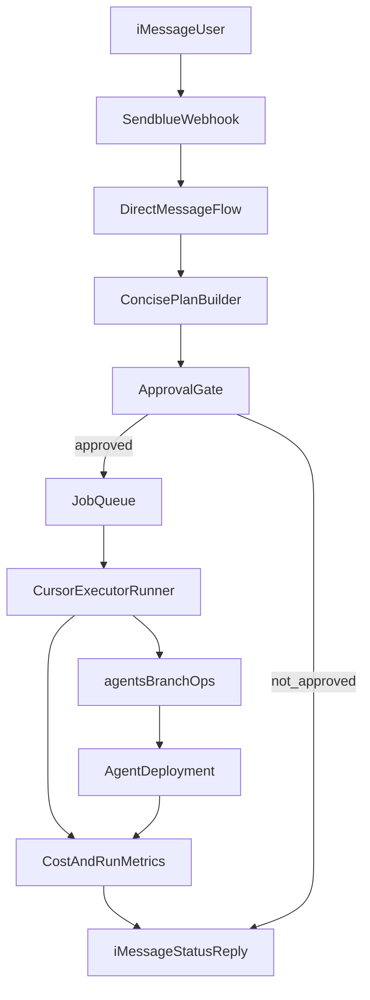

# ADD Mode Orchestrator Plan (Detailed + Plain Language)

## Why this document exists

- This is the long-form version of the ADD plan.
- It is written in simpler language, but it keeps the technical details.
- It is meant to survive chat loss, compression, or deleted history.
- It is the working blueprint for building agent-driven development from iMessage.

## Locked decisions (already chosen)

- Branch naming: migrated to root-level ADD scope (`main` + `job-*`).
- Rollout style: hybrid.
  - Operate in the separate `altered-agents` repo directly.
- Safety gate: each implementation job needs explicit approval before execution.
- Core boundary rule: agent workflows can read human branches, but must never write outside `main` and `job-*`.

## Quick glossary (simple terms)

- ADD mode: Agent Driven Development mode.
- Human branch: your normal branch flow (`main` + human feature branches).
- Agent branch: `main` or any `job-*` branch.
- Job: one requested unit of work, for example “add `/distill` command”.
- Plan card: short bullet plan shown in iMessage before work starts.
- Cursor runner: a remote/background worker that uses Cursor tooling/APIs to edit a git repo without needing your MacBook open.
- Executor: the worker backend that runs coding tasks (Cursor runner first, sandbox runner later).
- Control plane: the logic that receives iMessage requests, tracks state, and decides what runs next.
- Agent deployment: the app instance that runs with separate agent credentials/resources.

## Product intent this plan preserves

- You want to move faster with a phone-first surface.
- You want short iMessage planning messages, not heavy chat walls.
- You still want control over direction, cost, and feature behavior.
- You want agent code and human code clearly separated.
- You want to use agent-built features early, even if they are not final quality.
- You want full observability on spend and behavior before trusting automation.

## Existing code anchors to extend

- Webhook entry: [`packages/api-experimental/src/routers/webhooks/sendblue.ts`](packages/api-experimental/src/routers/webhooks/sendblue.ts)
- Chat webhook bridge: [`packages/server-experimental/src/chat/providers/imessage/webhook.ts`](packages/server-experimental/src/chat/providers/imessage/webhook.ts)
- DM response logic: [`packages/server-experimental/src/chat/providers/imessage/events/direct-message/build-response.ts`](packages/server-experimental/src/chat/providers/imessage/events/direct-message/build-response.ts)
- Chat event registration: [`packages/server-experimental/src/chat/providers/imessage/events/registrar.ts`](packages/server-experimental/src/chat/providers/imessage/events/registrar.ts)
- Environment contract: [`packages/core-experimental/src/config/environment.ts`](packages/core-experimental/src/config/environment.ts)
- Preview tooling is treated as optional historical context, not a dependency for this build.

## High-level architecture

## Core rules (non-negotiable)

- Never write outside `main` and `job-*` branches from ADD workflows.
- Always rebase/sync active ADD branch from `main` before new job execution.
- Agent is allowed to override code on `main` and `job-*` as needed.
- Agent deployment must use separate resources:
  - separate iMessage number,
  - separate database (or strict DB branch),
  - separate Redis/queue,
  - separate provider keys,
  - separate Vercel project/env scope.
- Every implementation job is “plan first, approve second, execute third”.
- Every job must produce machine-readable run records and human-readable status.
- Any automated action must stay inside explicit allowed scope only:
  - agent database branch/resource,
  - agent codebase/repository,
  - agent deployment/project/domain,
  - explicitly approved provider accounts.
- Any resource, codebase, account, deployment, or domain not explicitly designated for agent use is blocked by default.
- Mirrored app code should stay symmetric with human code where possible:
  - do not rename normal app concepts just to add “agent” labels,
  - keep existing variable names like Sendblue config names,
  - separate behavior by deployment environment and credentials, not by rewriting core naming in code.
- Local env loading rule for ADD workflows:
  - always load from `.env.agents` explicitly,
  - never rely on implicit `.env` inference in agent workflows,
  - delay env-dependent runtime tests until agent env values are provided.

## Phase 1: Governance + branch safety foundation

### Goal

Create hard branch rules so agent automation cannot leak into human code.

### Deliverables

- Canonicalize ADD branch scope to root-level:
  - Use `main` for cohesive updates.
  - Use `job-*` for isolated ADD execution branches.
- Branch sync contract:
  - Before starting a job, runner fetches human `main`.
  - Runner rebases current ADD branch onto `main`.
  - If conflict happens, runner auto-resolves using current feature direction when safe.
  - Runner only pauses for conflicts that require conceptual product-direction decisions.
- Job branch pattern:
  - Create `job-<id>-<slug>`.
  - Run work there.
  - Merge back to `main` only when checks pass.
- Write guards:
  - Add guard checks in runner logic that reject write targets outside `main` and `job-*`.
  - Add preflight validation that current branch matches allowed prefix.
- Remote alignment:
  - Use git remote `git@github.com:usealtered/altered-agents.git`.
  - Store this as expected upstream in bootstrap validation.

### Success criteria

- No accidental write path exists to `main` from ADD flow.
- Runner can prove branch sync occurred before execution.
- Conflict situations are surfaced clearly via iMessage.

## Phase 2: ADD control plane (plan -> approve -> run)

### Goal

Turn iMessage into a short, controlled planning + execution entrypoint.

### iMessage UX rules

- Default response style is concise.
- For new requests, system returns a short plan card:
  - 3-7 top bullets, very short wording.
- User can ask to expand any bullet.
- User can approve:
  - full plan,
  - or approve/reject per bullet if needed.
- Only after approval, job enters queue.

### Command shape (intent-first + slash fallback)

- Primary interface is natural language intent, for example:
  - “Make a plan for X.”
  - “Expand point 2.”
  - “Approve this plan.”
  - “Reject this plan because Y.”
  - “Show run status for job 123.”
- A command-interpreter agent/subagent translates natural language into internal tool calls.
- Slash commands remain as fallback:
  - `/plan`, `/expand`, `/approve`, `/reject`, `/run-status`, `/stop`, `/cost`, `/health`.
- Add `/help` to list all available commands and examples.

### Data model to persist

- Plan snapshot:
  - user request text,
  - concise bullets,
  - expanded bullet details,
  - approval state,
  - timestamps.
  - persisted plan file path in repo for auditability.
- Job record:
  - job id,
  - linked plan id,
  - branch name,
  - requested scope,
  - status lifecycle.
- Artifact record:
  - commit SHAs,
  - deployment URLs,
  - logs,
  - errors,
  - metrics.
  - saved plan document used for that exact implementation run.

### Control flow behavior

- Queue jobs durably so webhook lifecycle does not lose work.
- Support background processing.
- For every implementation run, always save a plan document into the repository (for historical traceability and future review).
- Support explicit stop conditions:
  - hard error,
  - cost cap hit,
  - time cap hit,
  - dependency unavailable.
- Group human-in-the-loop asks at practical checkpoints (for example deployment setup, sandbox choice, or missing external credentials), instead of interrupting repeatedly.
- Report progress milestones back to iMessage:
  - queued,
  - running,
  - awaiting approval,
  - blocked,
  - done.

### Success criteria

- User can request and approve work from iMessage with minimal typing.
- Jobs persist and recover after process restarts.
- No execution starts without approval.

## Phase 3: Cursor execution bridge

### Goal

Convert approved iMessage plans into actual code changes in `main`/`job-*`.

### Runner responsibilities

- Translate plan bullets into implementation prompt packs.
- Prepare branch and sync state.
- Run iterative coding loop:
  - implement,
  - check,
  - fix,
  - verify.
- Commit and push only in `main`/`job-*`.
- Return structured run output:
  - files changed,
  - commits,
  - checks,
  - blockers.

### Loop behavior requirements

- Supports “single approved job” mode first.
- Supports optional chained jobs later (still approval-gated per job by default).
- Can continue multiple steps without manual re-trigger if user explicitly says to continue until done.
- Auto-resolve routine errors by default (type errors, most merge conflicts, routine runtime issues) and continue.
- Must stop and report when:
  - conflict requires conceptual direction from user,
  - policy/scope violation is detected,
  - deployment fails repeatedly without a new hypothesis/solution path (for example 5-6 similar failures),
  - blocker is clearly external and cannot be solved from code (account access/permissions).
- Missing secrets should not automatically stop coding progress early:
  - continue implementation where possible,
  - surface secret gaps at integration/testing checkpoint.

### Pluggable execution boundary

- Cursor runner is first backend (remote/background; not dependent on local open laptop session).
- Future backend can be sandbox runner.
- Control plane API must not depend on runner internals.

### Success criteria

- One approved job can run end-to-end from iMessage request to pushed branch result.
- Runner output is structured and explainable in plain language.

## Phase 4: Deployment + resource isolation

### Goal

Keep agent app runtime fully separated from human app runtime.

### Isolation contract

- Separate iMessage number for agent deployment.
- Separate DB / DB branch reserved for agent environment.
- Separate Redis / queue namespace.
- Separate provider secrets for agent app.
- Separate Vercel deployment identity and domain aliasing.
- Explicit allowlist of domains/resources the agent deployment may touch.

### Deployment behavior

- Deploy from `main`/`job-*` workflows only.
- Include deployment metadata in job artifacts.
- Do not depend on preview promotion flow for this project phase.

### Hard safety checks

- Boot-time config checks must fail if:
  - agent deployment points to human DB URL,
  - agent deployment points to human Sendblue number,
  - deployment target is outside explicit agent-allowed domain list,
  - required runtime variables for enabled features are missing at execution time.

### Optional bootstrap for data parity

- One-time import path to copy selected human data into agent environment.
- Keep this controlled and explicit, not continuous hidden sync.

### Success criteria

- Agent feature tests can run safely without affecting human production resources.
- Separate numbers/deployments/resources make runtime context naturally separate without extra in-chat context labeling logic.

## Phase 5: full observability + cost controls

### Goal

Track what costs money, what takes time, and what fails.

### Metrics to capture per generation and per job

- Model/provider used.
- Prompt/input/output tokens.
- Estimated and measured cost.
- Duration of generation and total job runtime.
- Retry counts.
- Queue wait time.
- Git outcomes.
- Deployment outcomes.

### Reporting surfaces

- iMessage quick commands:
  - latest job cost,
  - daily/weekly spend,
  - active jobs,
  - last failure,
  - top expensive features.
- Persisted records for later dashboards.

### Guardrails

- Even in “always approve before run”, show pre-run cost estimate warning for expensive jobs.
- Show post-run actual spend summary.
- Flag anomalies:
  - sudden token spikes,
  - repeated retries,
  - unusual long durations.

### Success criteria

- You can answer “what did this feature cost?” quickly from iMessage.
- You can see trend and risk before bills surprise you.

## Phase 6: hybrid-to-repo migration path

### Goal

Keep root-branch ADD execution stable inside the separate agent repo.

### Requirements

- Keep repo URL and branch prefix configurable.
- Avoid hard-coding same-repo assumptions in queue, runner, and deployment layers.
- Build migration checklist:
  - repo remote check,
  - auth check,
  - deployment project check,
  - branch protection check,
  - dry run check.

### Decision rule for migration

- Move when same-repo friction grows (CI conflicts, branch noise, deployment overlap, safety concerns).
- Until then, keep same-repo model stable and low-ceremony.

### Success criteria

- Switching to a separate agent repo is mostly configuration + bootstrap, not architecture rewrite.

## Policy for in-repo code vs external sandboxes

### Why this section exists

You outlined two valid paths. We keep both, with clear default behavior.

### Default policy

- Core platform and reusable building blocks:
  - implement on `main`/`job-*` in repo.
- Highly specific user-land integrations:
  - prefer sandbox execution when it avoids polluting core code.

### Promotion policy

- If sandbox code proves valuable and general enough, promote into repo as reusable component.
- Keep references/artifacts so useful sandbox work is not lost.

## Plan detail level + message-size policy

- iMessage replies stay concise by default to control cognitive load and token cost.
- Any bullet can be expanded on request.
- Planner should avoid long prose unless user asks for deep detail.
- System should preserve full internal details in stored plan/job artifacts even when outward messages are short.

## Multi-job behavior policy

- Default: one approved job at a time.
- Optional batch mode (later):
  - user approves a set of jobs,
  - runner executes in safe order,
  - reports after each or at configured intervals.
- Parallel execution can be added later with conflict control, but sequential mode is first target for reliability.

## End-to-end validation gates (ready for daily use)

- Dry-run plan and approval from iMessage, no code changes.
- One real approved feature run on `main`/`job-*`.
- Branch sync check proves rebase happened before run.
- Deployment succeeds to agent environment and returns URL.
- Observability outputs include cost, duration, and status.
- Forced failure test shows clean error reporting and safe stop behavior.
- Safety test confirms no writes outside `main`/`job-*` and no human resource writes.

## Human tasks needed during implementation

- Provision agent-specific provider credentials.
- Provision separate iMessage number for agent deployment.
- Provision separate DB/Redis resources for agent environment.
- Set Vercel project/env values for agent deployment.
- Confirm org remote and repository permissions for automation.
- Confirm preferred remote execution substrate for Cursor runner (API-managed runner, sandbox-hosted runner, or equivalent).

## Out of scope for this build (explicit)

- Final polished product UX for all end users.
- Perfect long-term architecture for every future agent feature.
- Full autonomous free-run with no approvals.
- Full distributed parallel feature development on day one.

## Final expected outcome

- You can text a short request from iMessage.
- You receive a concise plan.
- You approve.
- The system builds the feature on `main`/`job-*`, deploys it to agent resources, and reports cost + status.
- You keep human code clean and protected while still getting faster feature access.
